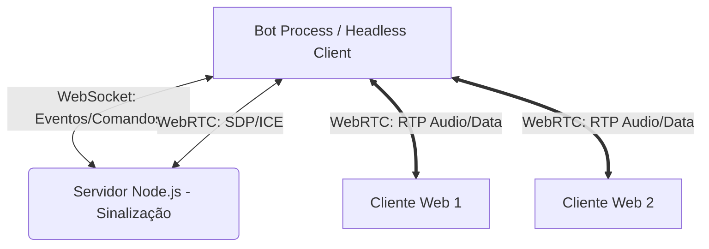

# Planejamento de Arquitetura: Sistema de Agentes (Bots) 🤖

Este documento detalha a infraestrutura técnica e o roadmap de implementação para integrar bots ao AuraVoice, permitindo que entidades autônomas interajam via áudio e texto dentro da nossa infraestrutura WebRTC P2P e WebSocket.

## 1. Topologia de Conexão dos Agentes

Dado que o nosso sistema atual utiliza uma topologia P2P (Mesh) sem um servidor de mídia centralizado (SFU/MCU), os bots precisarão se comportar como "clientes virtuais".



> [!WARNING]
> Como estamos em P2P Mesh, cada bot precisará abrir uma conexão WebRTC (`RTCPeerConnection`) com cada cliente na sala. Em salas muito grandes, isso vai exigir bastante processamento na máquina onde o bot estiver rodando.

## 2. Tipos de Agentes Planejados

### 🎵 2.1 Bot de Música (Audio Streamer)
- **Função**: Transmitir áudio de fontes externas (YouTube, Spotify, arquivos locais) em alta qualidade.
- **Implementação**: 
  - Utiliar `ffmpeg` ou bibliotecas Node.js como `fluent-ffmpeg` para capturar a stream de áudio.
  - Usar a API nativa WebRTC Server (`wrtc` ou `node-webrtc`) no lado do bot para injetar esse áudio na trilha de mídia enviada aos peers.
- **Comandos**: `!play <url>`, `!skip`, `!stop`, `!volume <1-100>`.

### 🧠 2.2 Bot de Conversação IA (LLM Assistant)
- **Função**: Um participante ativo que escuta as conversas por áudio (Speech-to-Text) e responde verbalmente (Text-to-Speech) integrado a um LLM.
- **Implementação**:
  - **Recepção (STT)**: O bot extrai o áudio dos canais `MediaStreamTrack` recebidos via WebRTC e os processa com Whisper ou serviços de transcrição como AssemblyAI/Google STT.
  - **Processamento**: Envio do texto com contexto para a OpenAI API (ChatGPT) ou Gemini.
  - **Emissão (TTS)**: A resposta textual passa pela API da ElevenLabs ou OpenAI TTS e o buffer de áudio é enviado de volta pelos canais WebRTC.
- **Desafios**: Latência. Precisamos otimizar a latência fim-a-fim para que o bot não demore muito antes de falar.

### 🛡️ 2.3 Bot de Moderação e Utilitário
- **Função**: Controlar acesso, gravar logs de texto (quando chat de texto for lançado), e gerenciar estado de salas (auto-kick de inativos).
- **Implementação**: Totalmente focado nas chamadas WebSocket, este bot não precisará abrir conexões WebRTC, reduzindo a carga do servidor. O bot se inscreve nos eventos `user-joined` e evalua as permissões de acesso.

## 3. Infraestrutura Técnica Necessária

1. **Client Node.js**: O bot será um script isolado conectando no servidor através da dependência `socket.io-client`.
2. **Biblioteca WebRTC Server**: Usaremos `node-webrtc` (ou API WebRTC nativa no Node LTS) para habilitar suporte a `RTCPeerConnection` fora de navegadores.
3. **Controlador de Audio (Media Mixer)**: Capacidade de silenciar temporariamente o bot, gerenciar a flag `isSpeaking` (enviada via signaling) e decodificar fluxos Opux recebidos via WebRTC.

## 4. Fases de Implementação (Roadmap)

### Fase 1: Fundação do "Cliente Virtual"
- [ ] Criar framework básico de bot CLI rodando em Node.js.
- [ ] O Bot consegue se autenticar pelo Socket e escolher um canal.
- [ ] O Bot aparece na UI (frontend) para os outros participantes.

### Fase 2: Injeção de Áudio (Áudio Sintético)
- [ ] O Bot consegue ler um arquivo de áudio `file.mp3` e enviar para os peers via WebRTC.
- [ ] Disparo manual de efeitos sonoros pela CLI.
- [ ] Teste de performance de conexão P2P de áudio para múltiplos peers.

### Fase 3: Capacidades Inteligentes (LLM)
- [ ] Integração com OpenAI API na arquitetura do bot.
- [ ] Pipeline Speech-to-Text: Pegar stream WebRTC dos usuários, salvar partes passadas e transformar em texto.
- [ ] Pipeline Text-to-Speech: Gerar a resposta de áudio em tempo real.

## 5. API do Bot (Draft)

```javascript
import { AuraVoiceBot } from './bot-framework';

const djBot = new AuraVoiceBot({
  username: 'Aura DJ',
  avatarColor: '#a855f7',
  serverHost: 'http://localhost:3000'
});

djBot.on('ready', () => {
    djBot.joinChannel('meu-servidor:sala-voz-1');
});

djBot.on('message', (msg, peerId) => {
   if (msg === '!ping') {
       djBot.playAudioFile('./pong.mp3');
   }
});
```
